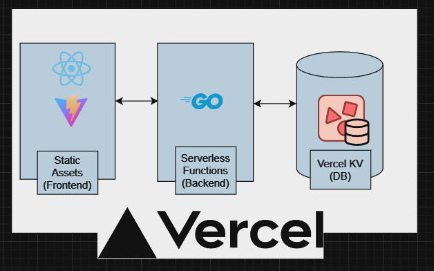

# App Overview
This is a simple chat app supposed to be hosted on Vercel.<br>
Tech stack is:<br>
Front - Vite + React<br>
Back  - Vercel serverless function with Golang<br>
DB    - Vercel KV(Redis)<br>


## Architecture


## Setup
### Frontend
```bash
#install packages
npm install

#run local(only frontend)
npm run dev
```
### Vercel KV
Vercel KV is basically redis database. Docker is necessary.
For windows:
```bash
# install
$ docker run -d --name redis-stack -p 6379:6379 -p 8001:8001 redis/redis-stack:latest
```
Local redis quick start document:<br>
https://redis.io/learn/howtos/quick-start

### Backend
Backend is Vercel serverless function, there's no way to emulate in local.<br>
One way is to run golang server locally, connect it with local redis container. <br>
Then, throw http request to the endpoint.

# Development

See README.development.md file.


